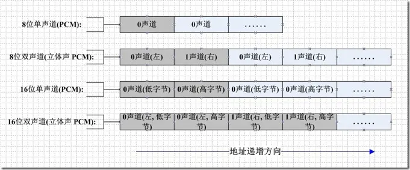
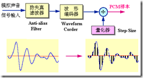
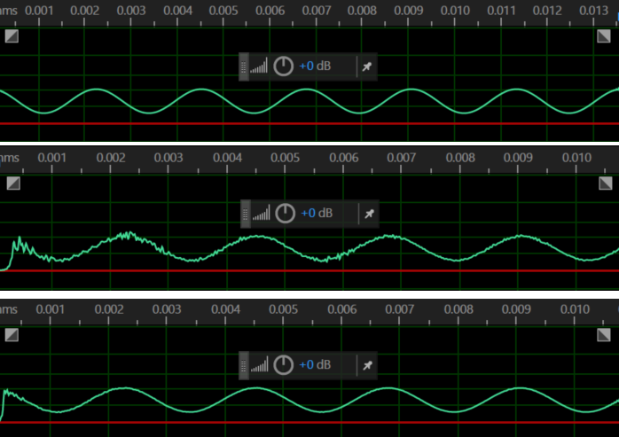

# g726
Simple G726 codec based on reference implementation.

# PCM音频数据
## 1. 什么是PCM？
PCM(Pulse Code Modulation，脉冲编码调制)
PCM音频数据是未经压缩的音频采样数据裸流，它是由模拟信号经过采样、量化、编码转换成的标准数字音频数据。

## 2. 描述PCM数据的6个参数：

1. Sample Rate : 采样频率。8kHz(电话)、44.1kHz(CD)、48kHz(DVD)。
2. Sample Size : 量化位数。通常该值为16-bit。
3. Number of Channels : 通道个数。常见的音频有立体声(stereo)和单声道(mono)两种类型，立体声包含左声道和右声道。另外还有环绕立体声等其它不太常用的类型。
4. Sign : 表示样本数据是否是有符号位，比如用一字节表示的样本数据，有符号的话表示范围为-128 ~ 127，无符号是0 ~ 255。
5. Byte Ordering : 字节序。字节序是little-endian还是big-endian。通常均为little-endian。
6. Integer Or Floating Point : 整形或浮点型。大多数格式的PCM样本数据使用整形表示，而在一些对精度要求高的应用方面，使用浮点类型表示PCM样本数据

## 3. PCM数据格式
如果是单声道的音频文件，采样数据按时间的先后顺序依次存入（有的时候也会采用LRLRLR方式存储，只是另一个声道的数据为0），如果是双声道的话就按照LRLRLR的方式存储，存储的时候与字节序有关。big-endian模式如下图所示：
 
## 4. 采样
采样用一个固定的频率对模拟信号进行提取样值。

常用采样率为8KHz,16kHz,22.05kHz，32kHz,44.1kHz,48kHz,192kHz。

人耳能够感觉到的最高频率为20kHz，要满足人耳的听觉要求，根据奈奎斯特采样定律则，需要每秒进行40k次采样，即40kHz。

8Khz的采样率就可以达到人的对话程度，通常电话的采样率为8kHz/16kHz。

常见的无线电广播采样率为22.05KHz，CD采样率为44.1kHz，DVD采样率为48kHz，Hi-Res音频采样率为192kHz
## 量化编码
量化编码就是把采样得到的声音信号幅度转换成数字值。这个过程会产生失真，量化的精度越高失真越小。常见的量化位数为8bit,16bit,24bit。

  

PCM约定俗成为无损编码，因为PCM代表了数字音频中最佳的保真水准，并不意味着PCM就能够确保信号绝对保真，PCM也只能做到最大程度的无限接近

# DPCM
DPCM（Differential Pulse Code Modulation），差分脉冲编码调

PCM是不压缩的，通常数据量比较大，存储和通讯都必需付出比较大的代价，早期的通讯是不能传输那么大的数据量的，所以就要想办法把数据压缩一下，以减少带宽和存储的压力。

假设我们以8kHz的采样率，16bit量化编码，则1秒的数据量为8000 * 16 = 128000 bit 。一般音频信息都是比较连续的，不会突然很高或者突然很低，两点之间差值不会太大，所以这个差值只需要很少的几个位（比如4bit）即可表示。这样，我们只需要知道前一个点的值，又知道它与下一个点的差值，就可以计算得到下一个点了。这个差值就是所谓的Differential ，将PCM数据转成DPCM数据，数据里会小很多，如上面所说的用4bit的表示差值，则1秒的(8kHz采样率16bit量化编码)PCM数据转成DPCM则只需要大约32000bit , 压缩比大约4:1。

# ADPCM
ADPCM(Adaptive Differential Pulse Code Modulation)、自适应差分脉冲编码调

音频信号虽然是比较连续性的，有些差值比较小，有些差值比较大，如果差值比较大有可能用4bit表示不了，如果增大表示差值的位数（例如8bit\16bit）是可以解决这个问题，但就导致数据量变大，没起到压缩的目的，而且这种差值比较大的只是少数，大部分还是差值比较小的。

为了解决这个问题，前辈们就想出了ADPCM，定义一个因子，用差值除以因子的值来表示两点之差，如果两点之间差值比较大，则因子也比较大。通过因子引入，可以使得DPCM编码自动适应差值比较大的数据。

ADPCM算法并没用固定标准，最经典的就是IMA ADPCM

# G.726
G.726是ITU-T定义的音频编码算法。1990年 CCITT（ITU前身）在G.721和G.723标准的基础上提出。G.726算法实质就是一个ADPCM
G.726有2bit,3bit,4bit,5bit算法
2bit压缩比比较大,损失也比较大
下图是pcm,2bit adpcm,4bit adpcm的波形对比
  

